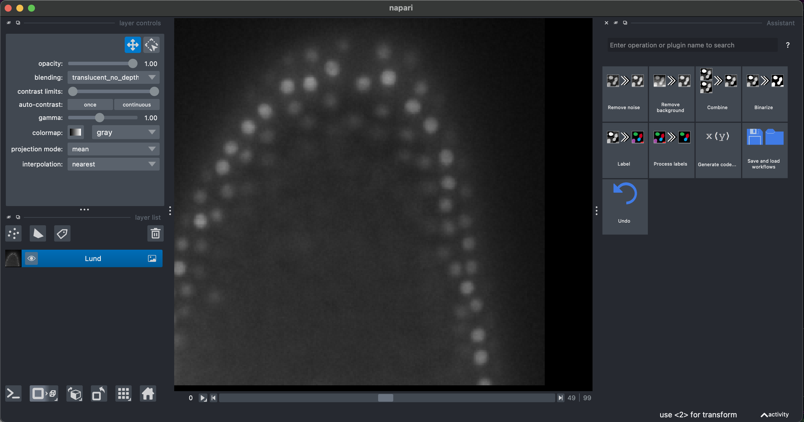
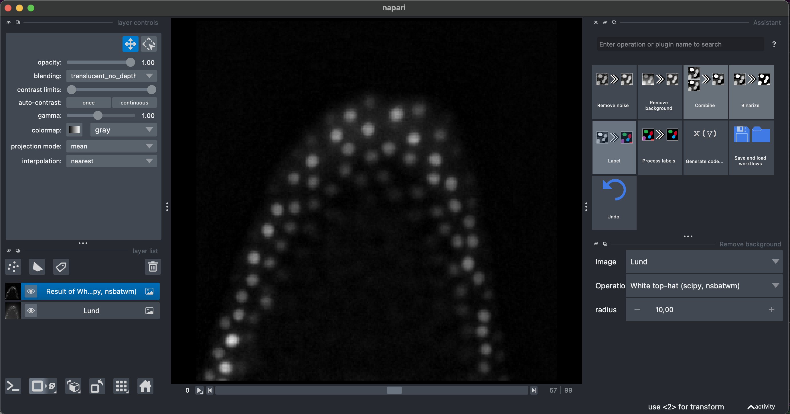
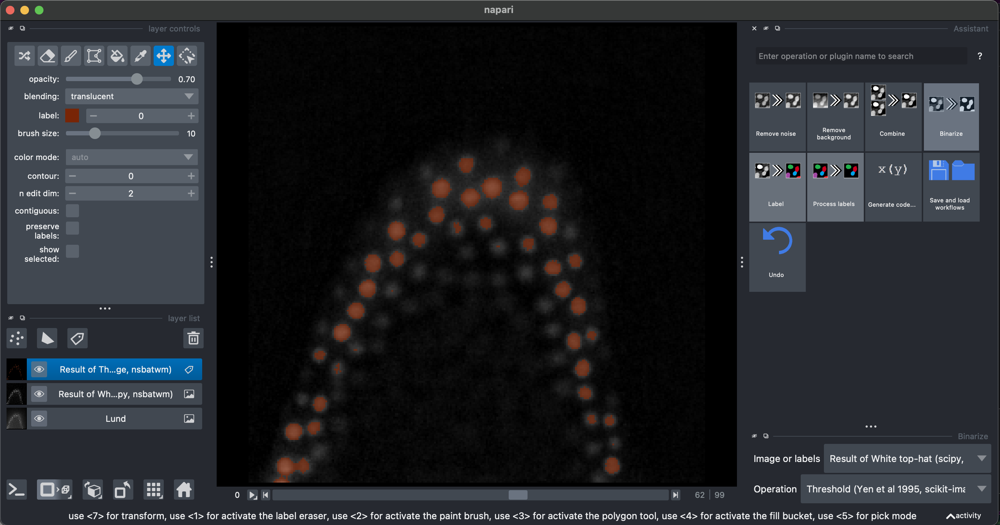
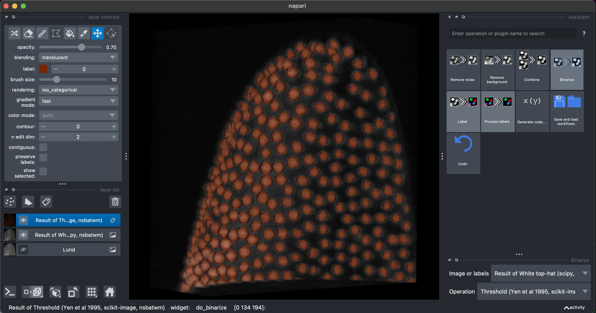
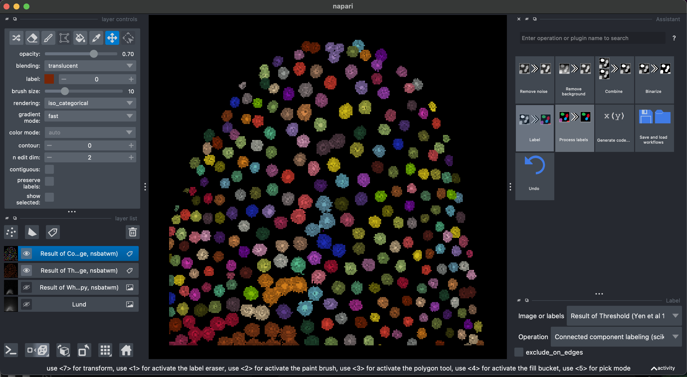
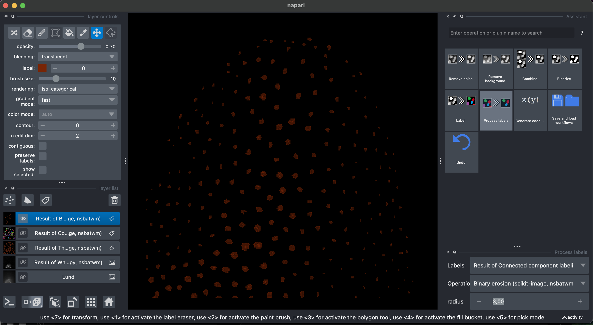
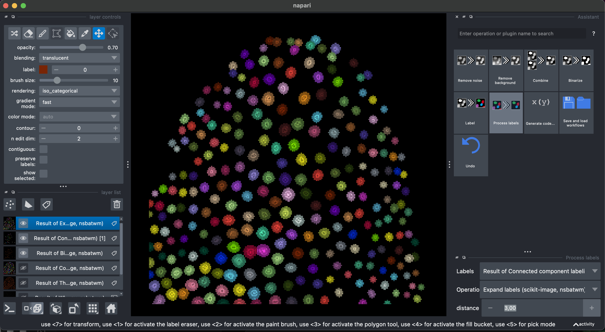
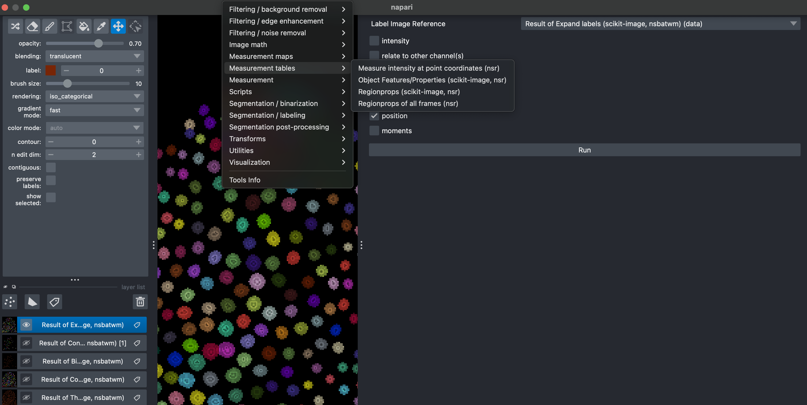
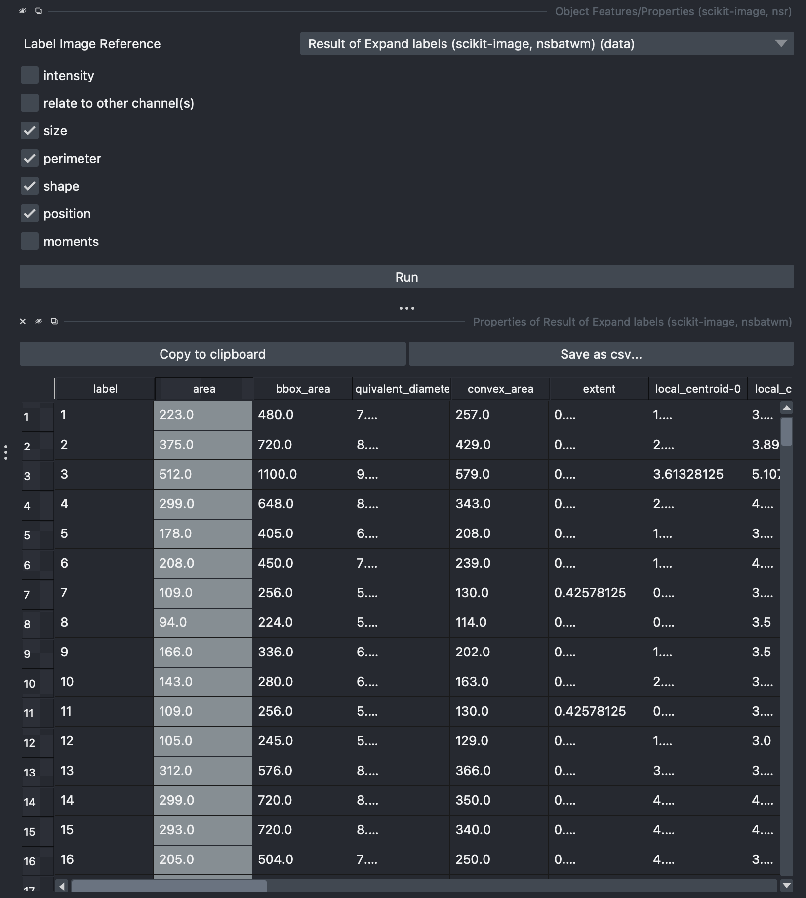
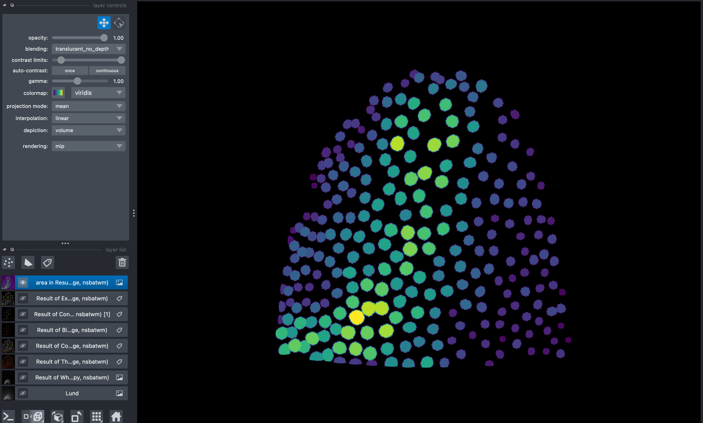

# Guía de Segmentación 3D con Napari

Esta guía práctica cubre el flujo de trabajo completo para la segmentación de imágenes 3D usando Napari y el plugin Napari Assistant.

## Objetivos de aprendizaje

Al finalizar esta sección, serás capaz de:
- Cargar y visualizar pilas de imágenes 3D en Napari
- Usar el Asistente de Napari para segmentación guiada
- Aplicar técnicas de preprocesamiento (eliminación de fondo, suavizado)
- Realizar umbralización y binarización
- Crear etiquetas de componentes conexos
- Refinar la segmentación mediante operaciones morfológicas
- Extraer y visualizar medidas morfológicas

## Descripción del pipeline de segmentación

El flujo de trabajo completo sigue estos pasos:

```
Imagen 3D cruda
    ↓
Preprocesamiento: Eliminar fondo y ruido
    ↓ 
Binarización: Convertir a máscara de primer plano/fondo
    ↓
Etiquetado: Asignar IDs únicos a objetos individuales
    ↓
Refinamiento: Mejorar la calidad de las etiquetas mediante operaciones morfológicas
    ↓
Cuantificación: Extraer medidas morfológicas y de intensidad
    ↓
Visualización: Analizar y explorar resultados
```

## Ejecución de la práctica

### Iniciar Napari con el plugin Asistente

```bash
pixi run assistant
```

Esto abre Napari con el panel del asistente de segmentación que te guía a través del flujo de trabajo.

## Pasos del flujo de trabajo

## Segmentación 3D en Napari

En este ejercicio vamos a:

- Usar Napari para abrir una imagen 3D
- Usar el asistente de Napari para visualizar un flujo de trabajo de segmentación y etiquetado de imágenes 3D
- Usar region props para cuantificar parámetros morfológicos y hacer gráficos con código de colores

Estos pasos forman un flujo de trabajo completo:  
**imagen cruda → preprocesamiento → segmentación → limpieza → etiquetado → medición → filtrado**

Usaremos `Lund.tif` como imagen de ejemplo https://zenodo.org/records/17986091.

Requisitos:
- Todo lo necesario está en el archivo toml en la carpeta Pixi/napari-assistant https://github.com/cuenca-mb/pixi-napari-assistant

### 0. Abrir el asistente de Napari con Pixi
En la terminal, ve al directorio Pixi/napari-assistant y ejecutá:

`pixi run assistant`

### 1. Abrir una pila 3D

Arrastrá y soltá el archivo o usá

`File → Open File`



Podremos ver y explorar la pila, y podemos cambiar a renderizado 3D con la opción `Toogle 2D/3D view` en el panel de botones inferior izquierdo. También podemos hacer vistas ortogonales haciendo clic en el botón de la derecha `Change order of the visible axis`.

En el panel derecho veremos el plugin Asistente, donde sugiere operaciones en el orden apropiado. La cantidad de operaciones y opciones depende de los plugins instalados. Algunas son redundantes.

### 2. Eliminar fondo, binarización y etiquetado

Seleccioná `Remove Background → White top hat  → radius = 10`



Luego seleccioná `Binarize → Threshold Yen`, asegurándote de seleccionar la imagen Result of White top-hat.



Recomiendo revisar el resultado en 3D.



Finalmente, podemos seleccionar `Label → Connected component labeling`, asegurándote de seleccionar la imagen Result of Threshold. Adicionalmente podemos seleccionar la opción `exclude on edges`.



Algunos están pegados entre sí. Intentemos solucionarlo.

### 3. Corregir etiquetas

Seleccionemos nuevamente la capa anterior Result of Threshold. Luego seleccioná `Process labels → Binary erosion → radius = 3`. Esto reducirá los objetos de la segmentación binaria.



Ahora recreemos las etiquetas `Label → Connected component labeling`, asegurándote de seleccionar Result of Binary Erosion.

Luego `Process labels → Expand Labels → radius = 3`. Explorá las etiquetas en 3D.



Ahora podemos medir con precisión las características morfológicas de estas etiquetas. Podés cerrar el panel del asistente ahora.

### 4. Medir propiedades morfológicas

Seleccioná `Tools → Measure Tables → Object Features/Properties`. Aquí asegurate de seleccionar la imagen Result of Expanded Labels. Podés seleccionar diferentes características, incluyendo características de intensidad extraídas de los datos crudos. Después de ejecutar, aparecerá una tabla que puede exportarse en formato csv.





Al hacer doble clic en cualquiera de las columnas de esta tabla, aparecerá una nueva capa de imagen con etiquetas con código de color que indica el valor de la medición seleccionada. Los mapas de color pueden ajustarse según preferencia.



### 5. Guardar el flujo de trabajo

Ahora podés seleccionar `Generate Code...` y exportar el flujo de trabajo que acabás de construir como un cuaderno Jupyter.


## Consejos y solución de problemas

### Problemas de calidad en la segmentación

**Problema**: Los objetos no están claramente separados o el fondo tiene ruido
- **Solución**: Ajustá el radio en el Paso 2 (White Top Hat). Un radio mayor elimina características de fondo más grandes
- Probá diferentes métodos de umbralización en el Paso 3
- Aumentá el radio de erosión en el Paso 5a para separar mejor los objetos tocantes

**Problema**: Los objetos pequeños están desapareciendo
- **Solución**: Usá un radio de erosión menor en el Paso 5a
- Considerá filtrar por tamaño en lugar de usar erosión (ver sección Avanzado)

**Problema**: Calidad de segmentación no uniforme en toda la imagen
- **Solución**: Probá umbralización local en lugar de global (si está disponible en tu versión de Napari)
- Considerá preprocesar con desenfoque gaussiano antes del white top hat

### Técnicas avanzadas

**Filtrado por tamaño**: Eliminar objetos menores a cierto tamaño
- Puede ser más efectivo que la apertura morfológica para algunas imágenes
- Proporciona un control más fino sobre la selección de objetos

**Procesamiento por lotes**: Aplicar la misma segmentación a múltiples imágenes
- El Asistente de Napari puede guardar/cargar configuraciones de parámetros
- Útil para procesar series de imágenes de forma consistente

## Requisitos de datos

Imagen de ejemplo: `Lund.tif` (disponible en https://zenodo.org/records/17986091)

Requisitos:
- Napari (herramienta principal de visualización)
- Plugin Napari Assistant (simplifica el flujo de trabajo)
- Plugin Region Props (para mediciones)
- Configuración con Pixi: `pixi install` en el directorio del repositorio

## Referencias

- [Documentación de Napari](https://napari.org/)
- [Morfología de Scikit-image](https://scikit-image.org/docs/stable/api/skimage.morphology.html)
- [Etiquetado de Componentes Conexos](https://en.wikipedia.org/wiki/Connected-component_labeling)
- [Morfología Matemática](https://en.wikipedia.org/wiki/Mathematical_morphology)
